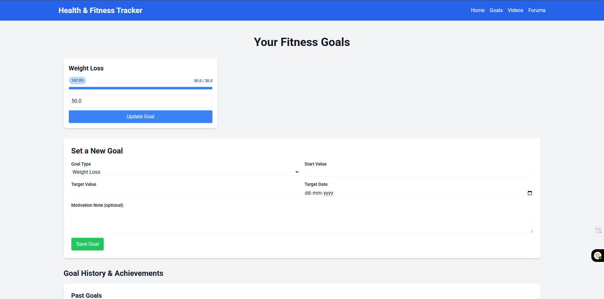
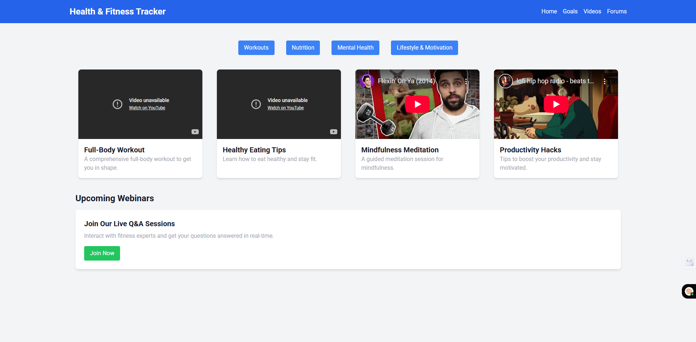
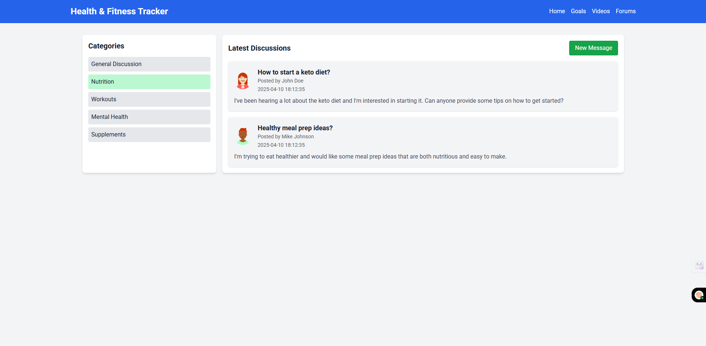

# Health & Fitness Website

## 🌟 Overview

Welcome to the **Health & Fitness Website** project! This web application helps users track fitness goals, learn from educational videos, and participate in a health-focused community forum.

---

## ✅ Features

- **Landing Page** – Sleek hero section with call-to-action  
- **Login/Register** – Secure user authentication  
- **Dashboard** – Goal tracking + featured videos + forum preview  
- **Goal Tracker** – Progress bars & goal updates  
- **Educational Videos** – YouTube videos by category  
- **Community Forum** – User discussions with avatars  
- **Avatar Generator** – RoboHash-style user identity

---

## 🖼️ Screenshots

### 🏠 Dashboard View


### 🎯 Goal Tracker


### 🎬 Educational Videos


### 💬 Community Forum


---

## 🗂️ Project Structure

```
/project-root
├── app/
|   ├── static/
|   ├── templates/
│   ├── backend.py
│   ├── database_connection.py
├── screenshots/
└── requirements.txt
```

---

## ⚙️ Setup Instructions

1. **Clone the repository**

```bash
git clone https://github.com/kritikaaaaaa27/fitness-and-health-web
cd fitness-and-health
```

2. **Create virtual environment**

```bash
python -m venv venv
source venv/bin/activate  # or venv\Scripts\activate on Windows
```

3. **Install dependencies**

```bash
pip install -r requirements.txt
```

4. **Run the server**

```bash
python app/backend.py
```

Open `http://localhost:5000` to view the app.

---

## 🔒 Auth Notes

- Uses `Flask-Login` for secure sessions
- Passwords stored as hashed strings via `pbkdf2:sha256`

---

## 🛠️ Future Plans

- [ ] Add custom AI features
- [ ] Dockerize deployment
- [ ] Support profile editing

---

## 📄 License

MIT License – © 2025 [Divesh Adivarekar](https://github.com/diveshadivarekar)
